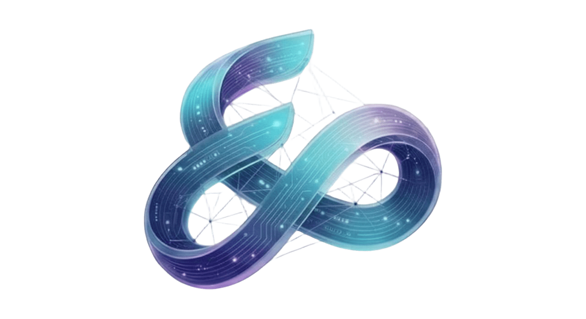

<div align="center">



<br/><br/>


<a href="https://www.eryonai.com">
  
</a>

<br/><br/>


</div>


## 📖 About

This is the official marketing website for **[ERYON AI](https://www.eryonai.com)** — an enterprise software engineering company delivering AI/ML solutions, cloud-native architecture, full-stack products, and cybersecurity for startups and global enterprises. The site is bootstrapped with [`create-next-app`](https://nextjs.org/docs/app/api-reference/cli/create-next-app) and built on the Next.js App Router.


## 🖥️ Site Sections

<div align="center">

| Section | Route | Purpose |
|---|---|---|
| 🏠 **Home** | `/` | Hero, value proposition, service highlights |
| ⚙️ **Services** | `/services` | AI/ML, cloud, mobile, cybersecurity, UI/UX offerings |
| 🚀 **Portfolio** | `/portfolio` | Case studies and selected client work |
| 🔄 **Process** | `/process` | Discovery → Architecture → Development → QA → Launch → Support |
| 📝 **Blog** | `/blogs` | Engineering insights and company updates |
| 📩 **Contact** | `/contact` | Project inquiries and lead capture |

</div>


## ✨ Key Features

- 📱 **Fully responsive** — mobile-first layouts across every breakpoint
- ⚡ **Optimized performance** — App Router, image optimization, and font optimization out of the box
- 🎨 **Design-system driven UI** — consistent spacing, typography, and component patterns via Tailwind CSS
- 🔍 **SEO-ready** — metadata, Open Graph tags, and semantic markup for discoverability
- ♿ **Accessible by default** — WCAG-aligned markup and keyboard navigation
- 🧩 **Modular components** — reusable sections for services, case studies, and testimonials
- 📊 **Analytics-ready** — structured for conversion tracking and funnel analysis


## 📁 Project Structure

```
eryon-ai-website/
├── app/
│   ├── page.tsx           # Home page
│   ├── layout.tsx         # Root layout (fonts, metadata, providers)
│   ├── services/          # Services section
│   ├── portfolio/         # Portfolio / case studies
│   ├── process/           # How-we-build section
│   ├── blogs/              # Blog listing & posts
│   └── contact/           # Contact / lead form
├── components/            # Shared UI components
├── public/                 # Static assets (logo, images, icons)
├── styles/                 # Global styles / Tailwind config
└── README.md
```


## 🛠️ Built With


## 🚀 Getting Started

Install dependencies, then run the development server:

```bash
npm run dev
# or
yarn dev
# or
pnpm dev
# or
bun dev
```

Open [http://localhost:3000](http://localhost:3000) with your browser to see the result.

You can start editing the page by modifying `app/page.tsx` — the page auto-updates as you edit the file.

<br/>

<div align="center">

| Command | What it does |
|---|---|
| `npm run dev` | Start the local dev server on port 3000 |
| `npm run build` | Create a production build |
| `npm run start` | Serve the production build locally |
| `npm run lint` | Run linting checks |

</div>


## 🔤 Fonts

This project uses [`next/font`](https://nextjs.org/docs/app/building-your-application/optimizing/fonts) to automatically optimize and load **[Geist](https://vercel.com/font)**, Vercel's font family — no manual font-loading or layout shift to manage.


## 📚 Learn More

To learn more about Next.js, take a look at the following resources:

- [Next.js Documentation](https://nextjs.org/docs) — learn about Next.js features and API
- [Learn Next.js](https://nextjs.org/learn) — an interactive Next.js tutorial
- [Next.js GitHub Repository](https://github.com/vercel/next.js) — feedback and contributions welcome


## ☁️ Deploy on Vercel

The easiest way to deploy this Next.js app is to use the [Vercel Platform](https://vercel.com/new?utm_medium=default-template&filter=next.js&utm_source=create-next-app&utm_campaign=create-next-app-readme) from the creators of Next.js.

Check out the [Next.js deployment documentation](https://nextjs.org/docs/app/building-your-application/deploying) for more details.

<br/>

<div align="center">


**[eryonai.com](https://www.eryonai.com)** &nbsp;·&nbsp; 📩 connect@eryonai.com

</div>
